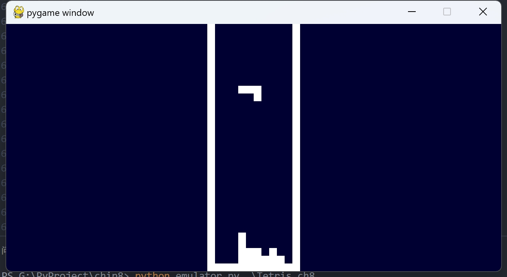

# chip8模拟器
CHIP-8 是 70 年代中期由 Joseph Weisbecker 发明的一个虚拟机，发明的初衷是为了让编写电子游戏更加方便。它最初在 1970 年代中期用于 COSMAC VIP 和 Telmac 1800 8 位微型计算机

这是一个 python 版本的 CHIP-8 模拟器， CHIP-8 可以被视为一个简单的计算机，是简要了解计算机工作原理的好方法。

我主要参考的两个资料：

http://devernay.free.fr/hacks/chip8/C8TECH10.HTM

https://github.com/mattmikolay/chip-8/wiki/CHIP%E2%80%908-Instruction-Set

第一个资料比较全面系统地阐述了 CHIP-8 的各个方面。

第二个资料主要是指令集的部分，它的排版看起来更加友好。


## 用法
项目根目录下内置了两个默认游戏，分别为俄罗斯方块和宇宙侵略者



```bash
python3 emulator.py .\Tetris.ch8
```